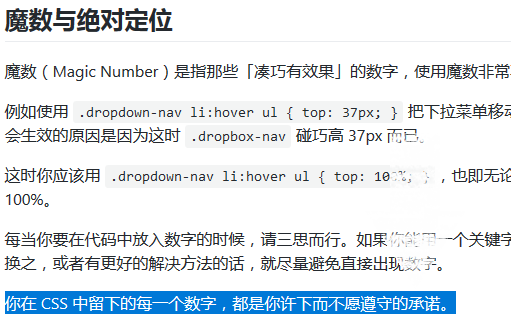

## CSS包含
    CSS3新特性
    选择器
    盒模型
    布局
    
    渐变
    变形
    过渡
    动画

### 布局
> [CSS入门](http://zh.learnlayout.com/media-queries.html)
1. position布局
2. 浮动布局
3. 百分比布局
4. 媒体查询+百分比布局
5. (移动布局)[viewport](https://dev.opera.com/articles/an-introduction-to-meta-viewport-and-viewport/) 适配  
    ```
    1. width=device-width
    2. height
    3. initial-scale
    4. maximum-scale | user-scalable=no
    ```
6. flex-box 支持

>排列
1. [block，inline和inline-block概念和区别](http://www.cnblogs.com/KeithWang/p/3139517.html)  

    常见的块级元素有 DIV, FORM, TABLE, P, PRE, H1~H6, DL, OL, UL 等。  
    常见的内联元素有 SPAN, A, STRONG, EM, LABEL, INPUT, SELECT, TEXTAREA, IMG, <font color="red">BR</font> 等。
2. 使用float或者inline-block来排列页面元素

### ！浏览器兼容性

1. [chrome font-size<12px](https://stackoverflow.com/questions/2295095/font-size-12px-doesnt-have-effect-in-google-chrome)  


### 编写规范

>一份规划良好的 CSS 应当按照[如下排列](https://github.com/chadluo/CSS-Guidelines/blob/master/README.md#%E4%BB%A3%E7%A0%81%E9%A1%BA%E5%BA%8F)
1.    **Reset** 万物之根源
2.    **元素类型** 没有 class 的 h1、ul 等
3.    **对象以及抽象内容** 最一般、最基础的设计模式
4.    **子元素** 由对象延伸出来的所有拓展及其子元素
5.    **修补** 针对异常状态


>

>[元素居中方案](https://segmentfault.com/a/1190000000381042#articleHeader6)
